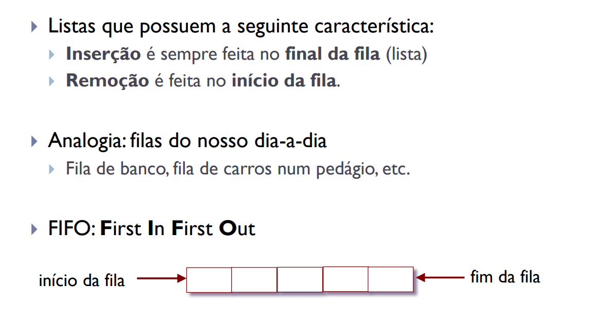

# Fila Encadeada em Java

Este projeto implementa uma Fila Encadeada em Java, com as seguintes operações:

- Criar uma fila vazia;
- Testar se a fila está vazia;
- Verificar se a fila está cheia;
- Obter o tamanho da fila;
- Consultar o elemento da frente da fila;
- Inserir um novo elemento no fundo da fila;
- Remover o elemento da frente da fila.

## Como Usar

Para testar as operações da lista, você pode usar a classe `Main` fornecida neste projeto.

## Funcionalidades Adicionais
Sinta-se à vontade para expandir este projeto adicionando mais recursos e otimizações, como tratamento de erros e métodos adicionais, para melhorar a flexibilidade e eficiência da lista.